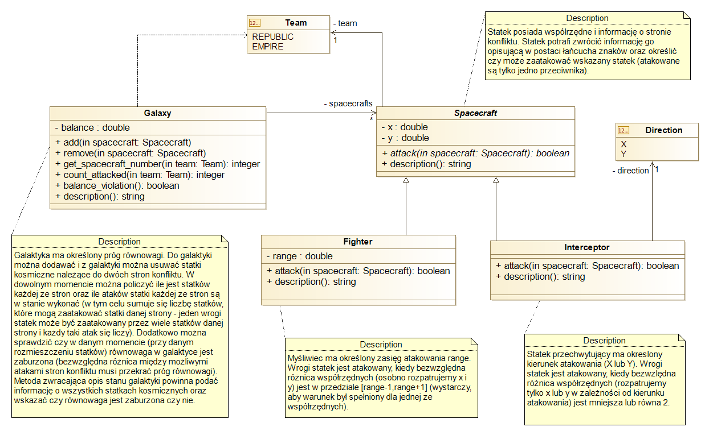

# Czytanie i pisanie diagramów UML w PlantUML

## Jak wygląda UML?

- **Klasy:** Prostokąty z nazwami *(Team, Galaxy, Spacecraft, Fighter, Interceptor, Direction)*. 
Każda klasa reprezentuje rodzaj obiektu, który ma swoje właściwości (atrybuty) i zachowania (metody)

- **Atrybuty:** Linie w klasach poniżej nazwy (np. - balance : double w Galaxy). To dane, które klasa przechowuje, np. balance to zmienna typu double.

- **Metody:** Też w klasach, np. + add(in spacecraft: Spacecraft) w Galaxy. To działania, które obiekty tej klasy mogą wykonywać (funkcje w klasie)

**Minus (-) oznacza obiekt prywatny, a plus (+) publiczny.**

Asocjacja (**linia z obiektu**, np. - spacecrafts(tu - nic nie znaczy?) między Team a Spacecraft): Pokazuje, że obiekty jednej klasy są powiązane z obiektami innej klasy. * między galaxy a spacecrafts oznacza relację 1 do wielu

Dziedziczenie (**strzałka z trójkątem**, np. od Fighter i Interceptor do Spacecraft): Oznacza, że Fighter i Interceptor są podtypami Spacecraft, czyli dziedziczą po nim atrybuty i metody

Kierunki szczałek:

 Dziedziczenie (generalizacja)
Strzałka z pustym trójkątem (jak między Fighter → Spacecraft)

Zawsze wskazuje na klasę nadrzędną (bazową).

Czyli: dziecko → rodzic.

Asocjacje (np. Galaxy → Spacecraft)
Linia z mnożnikami (*, 1) na końcach.

Nie musisz jej kierować, bo jest dwustronna – ale możesz ją opisać przez nazwy pól (np. -spacecrafts).

To jest zależność (ang. dependency) – przedstawia sytuację, gdzie jedna klasa "zna" drugą tylko chwilowo / używa jej w metodach. Galaxy nie przechowuje Team, ale używa go jako parametr

+ get_spacecraft_number(team: Team): integer
metoda:
- publiczna
- przyjmuje parametr wejściowy team typu team 
- zwraca int

Nawigowalność oznacza, czy jedna klasa ma bezpośredni dostęp do drugiej w kodzie
To znaczy, że:

obiekty klasy Galaxy znają swoje statki (Spacecraft),

mogą się do nich odwoływać, np. przez pole spacecrafts.

Ale:

Spacecraft nie zna Galaxy (chyba że osobno się doda takie powiązanie).

Checklista warunków robienia projektu:

- [x]  Prawidłowe rozłożenie odpowiedzialności między klasami (jedna klasa jedna odpowiedzialność)

- [x] Prawidłowe wykorzystanie mechanizmów hermetyzacji

- [ ] Właściwa organizacja komunikacji pomiędzy obiektami (właściwe zidentyfikowanie i przedstawienie związków między klasami)

- [ ] Właściwe zastosowanie dziedziczenia, abstrakcji i polimorfizmu (zasadność ich wykorzystania)
 - robimy tylko jedno dziedziczenie najlepiej
 - 

- [ ] Relacja jeden-wiele lub wiele-wiele (wymagająca użycia dynamicznych struktur)

**sprawdzić co to te dynamicnze struktury**

- [ ] Właściwa separacja logiki, interfejsu użytkownika i składowania danych

- [ ] Notatki na diagramie umożliwiające jego zrozumienie (w szczególności notatki zawierające wybrane scenariusze działania)
